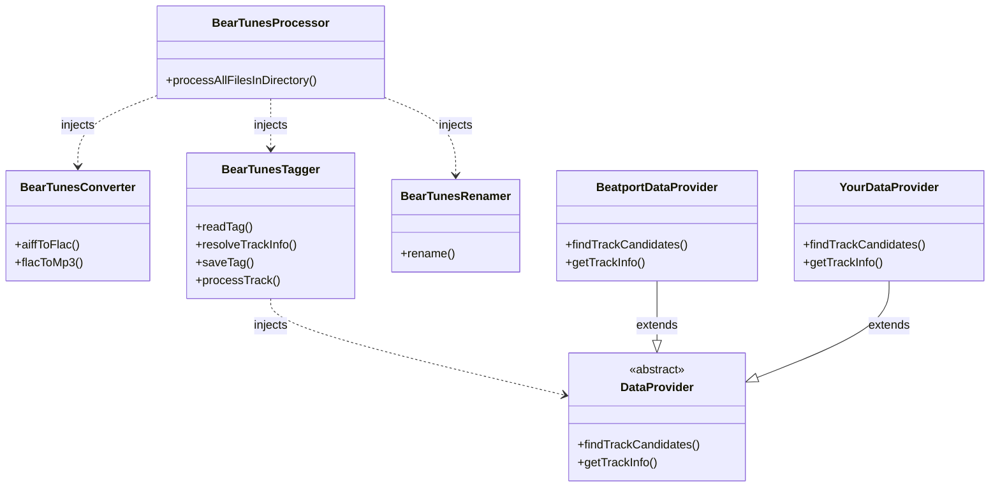
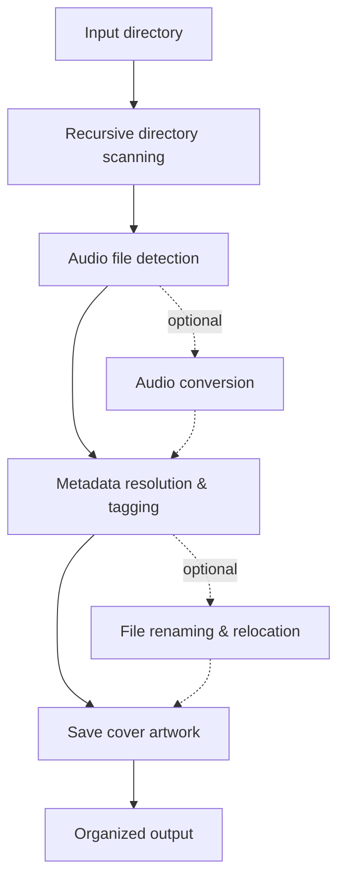

# bear-tunes

[](https://github.com/bearbyt3z/bear-tunes/actions/workflows/ci.yml)
[](https://nodejs.org/)
[](./LICENSE)

A TypeScript toolkit and CLI for converting, tagging, renaming, and organizing music files using Beatport or custom metadata providers.

**bear-tunes** provides reusable components for working with digital music libraries as well as a ready-to-use CLI. Its core functionality is exposed through configurable `BearTunes*` classes, allowing applications to use individual parts of the processing pipeline or combine them into a complete workflow.


## Why bear-tunes?

bear-tunes was created to provide a consistent way of organizing and tagging music files regardless of where the metadata comes from. Music may be sourced from platforms such as Beatport, Bandcamp, Juno Download, Traxsource, or SoundCloud, but the resulting local library should follow the same metadata and naming conventions.

Beatport is used as the default provider because its catalog offers particularly rich metadata for music-library organization and DJ-oriented workflows, including genre, BPM, key, catalog information, artwork, and detailed track and release data. The provider can be replaced through the public `DataProvider` API when another source is preferred or required.


## Features

* Process **MP3, FLAC, and AIFF** audio files.
* Recursively scan directory trees for supported audio files.
* Convert **AIFF → FLAC** and **FLAC → MP3**.
* Resolve track metadata from **Beatport**.
* Match local tracks with remote metadata using track and filename information.
* Write metadata to **ID3** and **FLAC tags**.
* Rename and organize files using metadata-driven patterns.
* Download and embed album artwork and additional image metadata.
* Handle ambiguous matches and significant duration differences interactively.
* Provide structured error handling and verbose logging.


## Tech Stack

| Technology | Purpose |
| ---------- | ------- |
| **TypeScript** | Main programming language. |
| **Node.js 20+** | Runtime environment. |
| **Python 3** | Used for the custom eyeD3 display plugin integration. |
| **Zod** | Runtime validation of application data and domain models. |
| **JSDOM** | HTML document parsing for metadata extraction. |
| **Playwright** | Fallback browser automation for handling CAPTCHA and anti-bot challenges. |
| **Winston** | Structured application logging. |
| **eyeD3** | MP3 metadata reading and writing through the Python package and CLI tool, including integration with the custom display plugin. |
| **FLAC / metaflac** | FLAC metadata handling and audio processing. |
| **LAME** | MP3 encoding. |


## Requirements


### Runtime

* Node.js **20 or newer**
* npm
* Python 3 with the `eyeD3` package


### System Dependencies

The following tools are required for audio conversion and metadata processing:

* `eyeD3`
* `flac`
* `metaflac`
* `lame`

These tools are invoked as external processes and must be available in the system `PATH`.


## Installation

Before installing bear-tunes, make sure all [requirements](#requirements) are installed and available in your system `PATH`.


### 1. Clone the repository

```bash
git clone https://github.com/bearbyt3z/bear-tunes.git
cd bear-tunes
```


### 2. Install Node.js dependencies

```bash
npm ci
```


### 3. Install the required Playwright browser

```bash
npm run setup
```


### 4. Build the project

```bash
npm run build
```

After a successful build, bear-tunes is ready to use through the CLI or directly from its TypeScript API.


## CLI Usage

The CLI accepts an optional input directory and an optional output directory:

```bash
npm run start -- [input-directory] [output-directory]
```

For example:

```bash
npm run start -- ./music ./organized
```

When no input directory is provided, the current working directory is used.

The application recursively scans the input directory and processes supported audio files.

The workflow can identify tracks using partial information from the original filename and enrich the resulting files with metadata from the configured provider.

```text
Before:

music/
├── First Artist - Track One.flac
└── 01 - Second Artist - Track Two Third Artist Remix.mp3
```

```text
After:

organized/
├── House/
│   └── First Artist, Another Artist/
│       └── First Artist, Another Artist - Track One (Original Mix).flac
└── Techno/
    └── Second Artist/
        └── Second Artist - Track Two (Third Artist & Another Remixer Extended Remix).mp3
```

In the first example, the original filename contains only one of the track's artists and does not specify the mix. bear-tunes enriches the filename with the missing artist and the `Original Mix` version.

In the second example, the input filename provides enough keywords to identify the remix, while the metadata provider supplies the complete remix information, including the additional remixer and the `Extended Remix` version.

The resulting files are organized according to the metadata-driven filename and directory patterns described below.


## Output Organization

bear-tunes can organize processed files using metadata-driven filename and directory patterns.

The default filename pattern is:

```text
%artists% - %title%
```

The default directory pattern is:

```text
%genre%/%artists%
```

These patterns are applied to the metadata resolved for each track, allowing the output directory structure and filenames to be generated automatically.


## Public API

The same processing capabilities are exposed through a reusable TypeScript API. Each component can be instantiated and configured independently, while `BearTunesProcessor` can combine them into a complete processing pipeline.

| Component | Responsibility | Main entry points |
| --------- | -------------- | ----------------- |
| `BearTunesProcessor` | Orchestrates directory-level audio processing. Uses dependency injection to accept custom converter, tagger, and renamer instances while providing sensible defaults. | `processAllFilesInDirectory()` |
| `BearTunesConverter` | Converts supported audio formats and controls encoding options. | `aiffToFlac()`, `flacToMp3()` |
| `BearTunesTagger` | Reads local metadata, resolves canonical track information, and writes tags. Uses dependency injection to accept a custom `DataProvider`, with `BeatportDataProvider` used by default. | `readTag()`, `resolveTrackInfo()`, `saveTag()`, `processTrack()` |
| `BearTunesRenamer` | Builds metadata-driven paths and renames or moves audio files. | `rename()` |
| `DataProvider` | Defines the contract for metadata sources used during track resolution, allowing custom providers to be integrated into the tagging workflow. | `findTrackCandidates()`, `getTrackInfo()` |
| `BeatportDataProvider` | Default `DataProvider` implementation that retrieves track metadata from Beatport. | `findTrackCandidates()`, `getTrackInfo()` |

The default tagger uses Beatport as its metadata provider, but a custom `DataProvider` implementation can be supplied when integrating bear-tunes into another application or workflow.


### Programmatic Usage

The processing pipeline can be used directly from TypeScript without going through the CLI.

```typescript
import { BearTunesProcessor } from '#processor';

const processor = new BearTunesProcessor();

await processor.processAllFilesInDirectory(
  './music',
  './organized',
);
```

The processor provides sensible defaults for its dependencies, including the converter, tagger, and renamer. Custom dependencies and options can be supplied through the constructor when more control over the processing pipeline is required.


### Customizing the Processing Pipeline

The processor can accept custom instances of its converter, tagger, and renamer dependencies. Each component can be configured independently before being injected into the processing pipeline.

```typescript
import { BearTunesProcessor } from '#processor';
import {
  BearTunesConverter,
  LameQuality,
  Mp3BitrateMode,
} from '#converter';
import { BearTunesTagger } from '#tagger';
import { BearTunesRenamer } from '#renamer';
import { BeatportDataProvider } from '#data-provider/beatport';

const converter = new BearTunesConverter({
  mp3BitrateMode: Mp3BitrateMode.CBR,
  mp3BitrateKbps: 256,
  lameQuality: LameQuality.Q2,
});

const tagger = new BearTunesTagger({
  dataProvider: new BeatportDataProvider(),
  lengthDifferenceAccepted: 5,
});

const renamer = new BearTunesRenamer({
  filenamePattern: '%artists% - %title%',
  directoryPattern: '%genre%/%artists%',
});

const processor = new BearTunesProcessor(
  {
    convertFlacToMp3: true,
    verbose: true,
  },
  {
    converter,
    tagger,
    renamer,
  },
);

await processor.processAllFilesInDirectory(
  './music',
  './organized',
);
```

This approach allows the processor to reuse fully configured components while keeping each dependency independently replaceable and reusable.


### Using Individual Components

The individual components can also be used independently when a complete processing pipeline is not required.

For example, `BearTunesConverter` can be used directly for audio conversion:

```typescript
import { BearTunesConverter } from '#converter';

const converter = new BearTunesConverter({
  mp3BitrateKbps: 256,
});

const result = await converter.flacToMp3('./track.flac');

if (result.ok) {
  console.log(`Created: ${result.outputPath}`);
}
```

Similarly, `BearTunesTagger` can be used directly to read metadata from a supported audio file:

```typescript
import { BearTunesTagger } from '#tagger';

const tagger = new BearTunesTagger();

const result = await tagger.readTag('./track.mp3');

if (result.ok) {
  console.log(result.trackInfo);
}
```

The same approach can be used with `BearTunesRenamer` and the metadata provider components when only a specific part of the workflow is needed.


## How It Works

The diagrams below illustrate the relationships between the public API components and the high-level processing workflow.


### Architecture

The public API is composed of independent components that can be configured and combined through dependency injection.




### Processing Flow

When a directory is provided for processing, bear-tunes scans it recursively and processes supported audio files through a metadata-driven workflow.




## Project Structure

The project is organized into focused modules, with the core music-processing functionality separated from the CLI and project tooling.


### Core modules

| Path                 | Purpose                                                                         |
| -------------------- | ------------------------------------------------------------------------------- |
| `src/converter/`     | Audio format conversion.                                                        |
| `src/data-provider/` | Metadata provider abstractions and implementations.                             |
| `src/logger/`        | Application logging.                                                            |
| `src/normalizer/`    | Metadata normalization.                                                         |
| `src/processor/`     | Main processing orchestration.                                                  |
| `src/renamer/`       | File renaming and relocation.                                                   |
| `src/shared-types/`  | Shared domain types and validation.                                             |
| `src/tagger/`        | Audio metadata reading and tagging.                                             |
| `src/tools/`         | Shared utilities and infrastructure integrations, independent of domain models. |


### Application, configuration, and build output

| Path                | Purpose |
| ------------------- | ------- |
| `src/main.ts`       | CLI entry point. |
| `src/main.types.ts` | CLI-specific types. |
| `src/config.ts`     | Application configuration. |
| `dist/`             | Generated JavaScript output produced by the TypeScript build. |


### Project tooling

| Path                      | Purpose                                   |
| ------------------------- | ----------------------------------------- |
| `.github/workflows/`      | Continuous integration configuration.     |
| `eyed3-display-plugin.py` | Custom eyeD3 display plugin for MP3 metadata extraction. |


## Development

### Development Workflow

The project uses a small set of automated checks to keep the codebase consistent and buildable during development.

```text
lint → typecheck → build
```

Run the complete local validation with:

```bash
npm run check
```


### Available Scripts

| Command               | Purpose                                                      |
| --------------------- | ------------------------------------------------------------ |
| `npm run lint`        | Runs ESLint across the project.                              |
| `npm run lint:fix`    | Automatically fixes available ESLint issues.                 |
| `npm run typecheck`   | Runs TypeScript type checking without generating output.     |
| `npm run build`       | Cleans the build output and compiles the TypeScript project. |
| `npm run clean`       | Removes the generated `dist/` directory.                     |
| `npm run build-start` | Builds the project and starts the CLI.                       |
| `npm run check`       | Runs linting, type checking, and the production build.       |


### Continuous Integration

The same quality checks are executed automatically by GitHub Actions for pushes to `master` and for pull requests.

The CI workflow runs on Ubuntu with Node.js 20, installs dependencies using `npm ci`, and executes `npm run check`.


## Important Notes

> [!NOTE]
> **Metadata matching may require user confirmation.** When metadata cannot be matched confidently, bear-tunes may ask for user confirmation rather than silently applying an uncertain match.

> [!NOTE]
> **CAPTCHA and anti-bot challenges may require user interaction.** Metadata retrieval normally starts with a regular HTTP request. When a challenge is detected, bear-tunes falls back to a persistent Playwright browser session. If the challenge cannot be resolved automatically, a visible browser session is opened so the user can complete it manually.

> [!WARNING]
> **AIFF source files can be removed after a successful conversion to FLAC.** The `BearTunesConverter.aiffToFlac()` method provides the `deleteAiffAfterConversion` option to control whether the original AIFF file is deleted. The default processing pipeline enables this option when performing AIFF conversion.


## License

bear-tunes is licensed under the **GNU General Public License v3.0 or later**.

See the [LICENSE](./LICENSE) file for the full license text.
