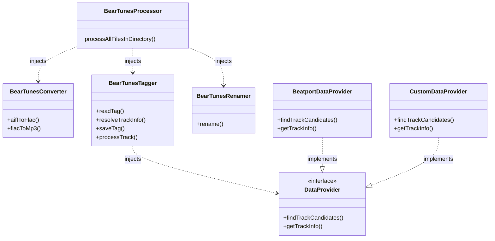
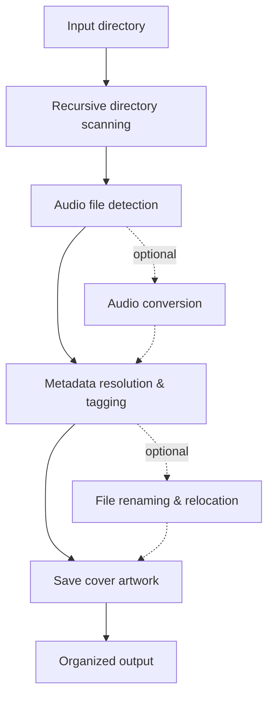

# bear-tunes

[](https://github.com/bearbyt3z/bear-tunes/actions/workflows/ci.yml)
[](https://nodejs.org/)
[](./LICENSE)

A TypeScript toolkit and CLI for converting, tagging, renaming, and organizing music files using Beatport or custom metadata providers.

**bear-tunes** provides reusable components for working with digital music libraries as well as a ready-to-use CLI. Its core functionality is exposed through configurable `BearTunes*` classes, allowing applications to use individual parts of the processing pipeline or combine them into a complete workflow.

## Features

* Process **MP3, FLAC, and AIFF** audio files.
* Recursively scan directory trees for supported audio files.
* Convert **AIFF → FLAC** and **FLAC → MP3**.
* Resolve track metadata from **Beatport**.
* Match local tracks with remote metadata using track and filename information.
* Write metadata to **ID3** and **FLAC tags**.
* Rename and organize files using metadata-driven patterns.
* Download and embed album artwork and additional image metadata.
* Handle ambiguous matches and significant duration differences interactively.
* Provide structured error handling and verbose logging.
* Run automated linting, type checking, and builds through GitHub Actions.

## Public API

The core functionality is exposed through reusable TypeScript classes. Each component can be instantiated and configured independently, while `BearTunesProcessor` can combine them into a complete processing pipeline.

| Component | Responsibility | Main entry points |
| --------- | -------------- | ----------------- |
| `BearTunesProcessor` | Orchestrates directory-level audio processing. Uses dependency injection to accept custom converter, tagger, and renamer instances while providing sensible defaults. | `processAllFilesInDirectory()` |
| `BearTunesConverter` | Converts supported audio formats and controls encoding options. | `aiffToFlac()`, `flacToMp3()` |
| `BearTunesTagger` | Reads local metadata, resolves canonical track information, and writes tags. Uses dependency injection to accept a custom `DataProvider`, with `BeatportDataProvider` used by default. | `readTag()`, `resolveTrackInfo()`, `saveTag()`, `processTrack()` |
| `BearTunesRenamer` | Builds metadata-driven paths and renames or moves audio files. | `rename()` |
| `DataProvider` | Defines the contract for metadata sources used during track resolution, allowing custom providers to be integrated into the tagging workflow. | `findTrackCandidates()`, `getTrackInfo()` |
| `BeatportDataProvider` | Default `DataProvider` implementation that retrieves track metadata from Beatport. | `findTrackCandidates()`, `getTrackInfo()` |

The default tagger uses Beatport as its metadata provider, but a custom `DataProvider` implementation can be supplied when integrating bear-tunes into another application or workflow.

## How It Works

bear-tunes is built around a modular processing pipeline that can be used through the CLI or assembled programmatically using its public API.

### Architecture

The public API is composed of independent components that can be configured and combined through dependency injection.



### Processing Flow

When a directory is provided for processing, bear-tunes scans it recursively and processes supported audio files through a metadata-driven workflow.



## Tech Stack

* **TypeScript**
* **Node.js 20+**
* **Zod** for runtime data validation
* **Playwright** for browser-based data retrieval
* **Winston** for logging
* **eyeD3** for MP3 metadata handling
* **FLAC / metaflac** for FLAC metadata and audio processing
* **LAME** for MP3 encoding
* **GitHub Actions** for continuous integration

## Requirements

### Runtime

* Node.js **20 or newer**
* npm
* Python 3 with the `eyeD3` package
* `flac`
* `metaflac`
* `lame`

The project invokes some audio and metadata tools as external processes, so they must be available in the system `PATH`.

## Installation

Clone the repository and install the Node.js dependencies:

```bash
git clone https://github.com/bearbyt3z/bear-tunes.git
cd bear-tunes
npm ci
```

Install the Playwright browser required by the project:

```bash
npm run setup
```

Build the application:

```bash
npm run build
```

## Usage

The CLI accepts an optional input directory and an optional output directory:

```bash
npm run start -- [input-directory] [output-directory]
```

For example:

```bash
npm run start -- ./music ./organized
```

When no input directory is provided, the current working directory is used.

The application recursively scans the input directory and processes supported audio files.

### Development shortcut

Build the project and start the CLI in one command:

```bash
npm run build-start -- ./music ./organized
```

## File Organization

By default, bear-tunes uses metadata-driven patterns for filenames and directories.

The default filename pattern is:

```text
%artists% - %title%
```

The default directory pattern is:

```text
%genre%/%artists%
```

This allows processed files to be organized using metadata rather than their original filenames.

## Development

Available npm scripts include:

```bash
npm run lint
npm run typecheck
npm run build
npm run check
```

`npm run check` runs the project's main quality gates:

```text
lint → typecheck → build
```

The same checks are executed automatically in GitHub Actions for pushes to `master` and for pull requests.

## Project Structure

The project is organized into focused modules, with the core music-processing functionality separated from the CLI and project tooling.

### Core modules

| Path                 | Purpose                                             |
| -------------------- | --------------------------------------------------- |
| `src/converter/`     | Audio format conversion.                            |
| `src/data-provider/` | Metadata provider abstractions and implementations. |
| `src/logger/`        | Application logging.                                |
| `src/normalizer/`    | Metadata normalization.                             |
| `src/processor/`     | Main processing orchestration.                      |
| `src/renamer/`       | File renaming and relocation.                       |
| `src/shared-types/`  | Shared domain types and validation.                 |
| `src/tagger/`        | Audio metadata reading and tagging.                 |
| `src/tools/`         | Shared utilities and integrations.                  |

### Application, configuration, and build output

| Path                | Purpose |
| ------------------- | ------- |
| `src/main.ts`       | CLI entry point. |
| `src/main.types.ts` | CLI-specific types. |
| `src/config.ts`     | Application configuration. |
| `dist/`             | Generated JavaScript output produced by the TypeScript build. |

### Project tooling

| Path                      | Purpose                                   |
| ------------------------- | ----------------------------------------- |
| `.github/workflows/`      | Continuous integration configuration.     |
| `eyed3-display-plugin.py` | eyeD3 helper for MP3 metadata extraction. |

## Notes

bear-tunes currently relies on Beatport as its metadata provider. When metadata cannot be matched confidently, the application may ask for user confirmation rather than silently applying an uncertain match.

The AIFF processing pipeline converts the source file to FLAC and removes the original AIFF file after a successful conversion. Make sure you have a backup when processing files that should be preserved unchanged.

## License

This project is licensed under the GNU General Public License v3.0 or later. See the [LICENSE](./LICENSE) file for details.
